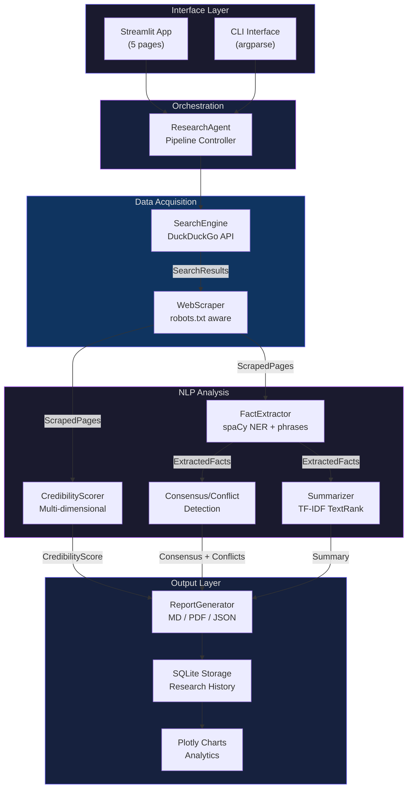
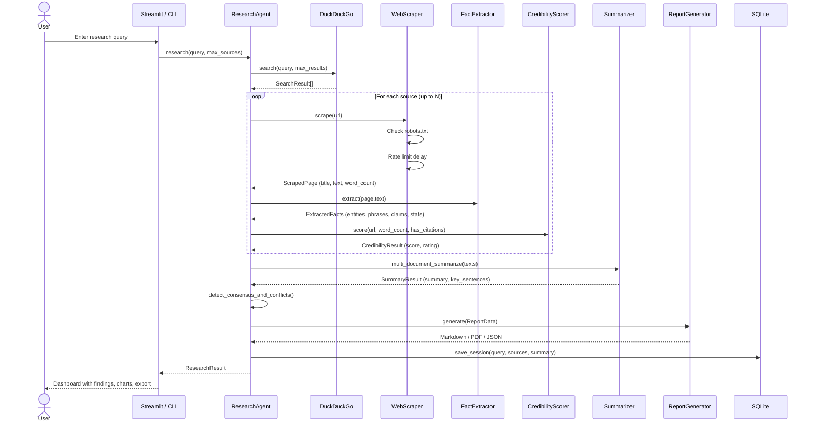

<div align="center">
  <h1>Veridex</h1>
  <p><strong>Open-source intelligence analyst that fact-checks the internet in real time.</strong></p>
  <p>
    
    
    
    
    
    
  </p>
  <p>
    <a href="#features">Features</a> &bull;
    <a href="#demo">Demo</a> &bull;
    <a href="#quick-start">Quick Start</a> &bull;
    <a href="#architecture">Architecture</a> &bull;
    <a href="#tech-stack">Tech Stack</a> &bull;
    <a href="#cli-reference">CLI</a> &bull;
    <a href="#docker">Docker</a>
  </p>
  
</div>

---

Veridex is an autonomous web research agent that searches the open web via DuckDuckGo, scrapes pages with robots.txt compliance and rate limiting, extracts structured facts using spaCy NLP, scores source credibility across multiple dimensions, and synthesizes multi-source findings into exportable reports. Every claim is traced back to its source. Every source is scored. Every conflict between sources is surfaced.

**No API keys. No LLM. No hallucinations.** All intelligence runs locally using classical NLP -- TF-IDF vectorization, TextRank summarization, named entity recognition, and cross-source verification.

---

## Features

**Autonomous Web Search** -- Queries DuckDuckGo and retrieves up to 10+ sources per research topic with automatic deduplication and relevance filtering.

**Robots.txt-Aware Scraping** -- Respects `robots.txt` directives, enforces rate limiting (configurable delay), and extracts clean text from HTML using BeautifulSoup + lxml.

**NLP Fact Extraction** -- spaCy `en_core_web_sm` pipeline extracts named entities (people, organizations, dates, locations), key phrases, statistical claims, and factual assertions from every source.

**Multi-Dimensional Credibility Scoring** -- Evaluates sources on domain authority, HTTPS usage, content depth (word count), citation density, and known-source matching. Results displayed as radar charts per source.

**Cross-Source Verification** -- Compares extracted claims across all sources to identify consensus points (multiple sources agree) and conflicts (unique or contradictory claims). Displayed as a claim verification matrix.

**Interactive Analytics Dashboard** -- Five Plotly charts: research activity over time, sources per query, credibility distribution (donut chart), top researched topics, and research timeline scatter plot.

**Multi-Format Export** -- Generate reports in Markdown, PDF (via FPDF2), or structured JSON with full citations, entity tables, and source credibility breakdowns.

**SQLite Research History** -- Every research session is persisted with full metadata. Search, filter, sort, and re-run past queries from the History page.

**Offline Demo Mode** -- Three pre-cached research queries (AI in healthcare, quantum computing, climate/renewables) work without network access for presentations and testing.

**Multi-Page Dashboard** -- Five-page Streamlit app: Dashboard (overview + quick stats), Research (live pipeline), History (past sessions), Analytics (Plotly charts), and About (architecture + tech stack).

---

## Demo

<table>
  <tr>
    <td align="center">
      
      <br/><em>Live research pipeline with tabbed results: findings, entities, sources, and full report</em>
    </td>
    <td align="center">
      
      <br/><em>Plotly-powered analytics: credibility distribution, activity trends, top topics</em>
    </td>
  </tr>
  <tr>
    <td align="center">
      
      <br/><em>Searchable research history with filters, sorting, and session re-run</em>
    </td>
    <td align="center">
      
      <br/><em>Responsive layout with dark theme and custom CSS design system</em>
    </td>
  </tr>
</table>

---

## Architecture



### Research Pipeline



---

## Quick Start

### Prerequisites

- **Python 3.12+**
- **[uv](https://docs.astral.sh/uv/)** (`curl -LsSf https://astral.sh/uv/install.sh | sh`)

### Install and Run

```bash
git clone https://github.com/Akasxh/veridex.git
cd veridex

uv sync
uv run python -m spacy download en_core_web_sm
uv run streamlit run src/app.py
```

The dashboard opens at [http://localhost:8501](http://localhost:8501). Demo mode works without network access.

### One-Liner

```bash
uv sync && uv run python -m spacy download en_core_web_sm && uv run streamlit run src/app.py
```

### Using Make

```bash
make install   # Install all dependencies
make run       # Start Streamlit (port 8501)
make dev       # Start with hot-reload
make test      # Run pytest suite
make lint      # Run ruff linter
```

---

## Docker

```bash
docker build -t veridex:latest .
docker run --rm -p 8501:8501 veridex:latest

# Or with Compose (persistent SQLite volume)
cp .env.example .env
docker compose up --build -d
```

The Docker setup includes multi-stage build, non-root `appuser`, named volume (`veridex-data`) for SQLite persistence, and health check endpoint.

---

## CLI Reference

```bash
# Run a research query
uv run python src/cli.py "impact of AI on healthcare"

# Specify max sources and export formats
uv run python src/cli.py "quantum computing breakthroughs" -n 8 -f markdown pdf json

# View research history
uv run python src/cli.py --history

# Run in demo mode (no network required)
uv run python src/cli.py --demo "AI healthcare"

# List available demo queries
uv run python src/cli.py --list-demos
```

| Flag | Description | Default |
|------|-------------|---------|
| `query` | Research topic (positional) | -- |
| `-n`, `--num-sources` | Maximum sources to scrape | `6` |
| `-f`, `--format` | Export formats: `markdown`, `pdf`, `json` | `markdown` |
| `--history` | Display all past research sessions | -- |
| `--demo` | Use pre-cached results (offline) | -- |

---

## Why No LLM?

1. **Zero hallucination risk** -- Every sentence traces back to a real source URL. TF-IDF extractive summarization selects actual sentences from actual documents.
2. **No API keys, no cost, no rate limits** -- Runs fully offline after initial web search. No vendor lock-in.
3. **Full transparency** -- The entire pipeline is inspectable. You can see exactly which sources contributed which facts.
4. **Reproducibility** -- Same query, same sources, same output. No temperature sampling.

---

## Responsible Scraping

- **robots.txt compliance** -- Every domain's `robots.txt` is fetched and parsed before scraping
- **Rate limiting** -- Configurable delay (default 1s) between requests to the same domain
- **User-Agent transparency** -- Identifies itself clearly in HTTP headers
- **Content-only extraction** -- Strips navigation, ads, scripts, and boilerplate
- **No login bypass** -- Does not attempt to circumvent paywalls or CAPTCHAs
- **Local processing only** -- No data sent to external APIs

---

## Tech Stack

| Layer | Technology | Purpose |
|-------|-----------|---------|
| **Language** | Python 3.12+ | Type hints, dataclasses |
| **Web UI** | Streamlit 1.40+ | Multi-page dashboard with custom CSS |
| **Charts** | Plotly 5.18+ | Interactive analytics (radar, donut, scatter, bar) |
| **NLP** | spaCy 3.8+ (`en_core_web_sm`) | NER, tokenization, POS tagging |
| **Summarization** | scikit-learn 1.5+ | TF-IDF + TextRank extractive summarization |
| **Search** | ddgs 7.0+ | DuckDuckGo search API wrapper |
| **Scraping** | BeautifulSoup4 + lxml | HTML parsing and clean text extraction |
| **PDF Export** | FPDF2 2.8+ | PDF report generation with citations |
| **Database** | SQLite (stdlib) | Research history persistence |
| **Packaging** | uv + hatchling | Fast dependency resolution and builds |
| **Linting** | ruff | Linting + formatting |
| **Testing** | pytest 9.0+ | Unit and integration tests |
| **Container** | Docker + Compose | Multi-stage build, health checks, named volumes |

---

## Project Structure

```
veridex/
├── src/
│   ├── __init__.py          # Package marker
│   ├── app.py               # Streamlit multi-page UI (1,397 lines)
│   ├── cli.py               # CLI interface with argparse
│   ├── agent.py             # Research pipeline orchestrator
│   ├── search.py            # DuckDuckGo search wrapper
│   ├── scraper.py           # Web scraping (robots.txt aware, rate-limited)
│   ├── extractor.py         # spaCy NLP fact extraction
│   ├── credibility.py       # Multi-dimensional credibility scoring
│   ├── summarizer.py        # TF-IDF TextRank multi-document summarization
│   ├── report.py            # Report generation (Markdown, PDF, JSON)
│   ├── storage.py           # SQLite research history
│   └── demo.py              # Pre-cached demo data for offline use
├── tests/
│   ├── conftest.py          # Shared pytest fixtures
│   ├── test_credibility.py
│   ├── test_demo.py
│   ├── test_extractor.py
│   ├── test_report.py
│   ├── test_scraper.py
│   ├── test_search.py
│   ├── test_storage.py
│   └── test_summarizer.py
├── screenshots/
├── Dockerfile               # Multi-stage Docker build
├── docker-compose.yml       # Compose with persistent volume
├── Makefile                 # Build, run, test, lint commands
├── pyproject.toml           # Project config (uv + hatch)
├── .env.example
├── .gitignore
└── LICENSE                  # MIT
```

---

## Testing

```bash
uv run pytest tests/ -v

# Run a specific test module
uv run pytest tests/test_credibility.py -v

# Quick import check
uv run python -c "from src.agent import ResearchAgent; print('All imports OK')"
```

---

## Contributing

1. Fork the repository
2. Create a feature branch (`git checkout -b feature/your-feature`)
3. Make changes with type hints and tests
4. Run `make lint` and `make test`
5. Open a pull request

---

## License

[MIT](LICENSE)

---

<div align="center">
  <p>Built with classical NLP, zero API keys, and a healthy skepticism of everything on the internet.</p>
</div>
